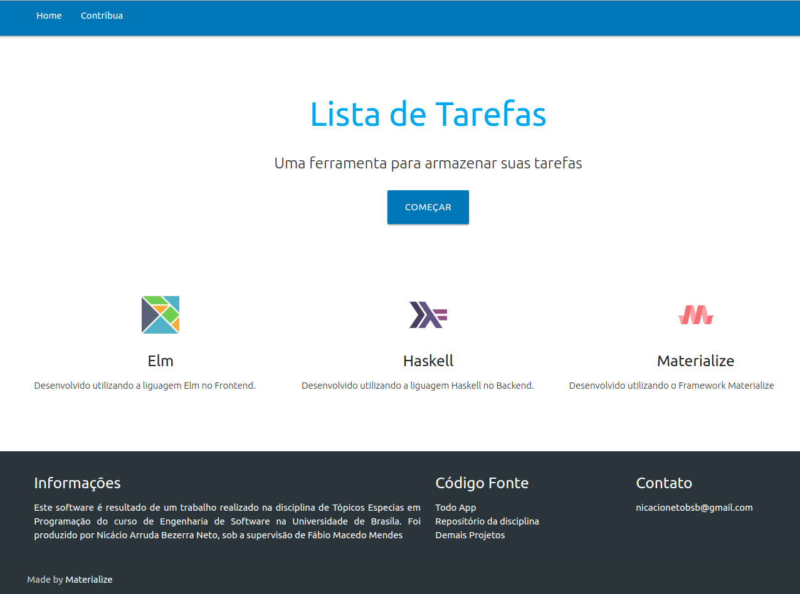
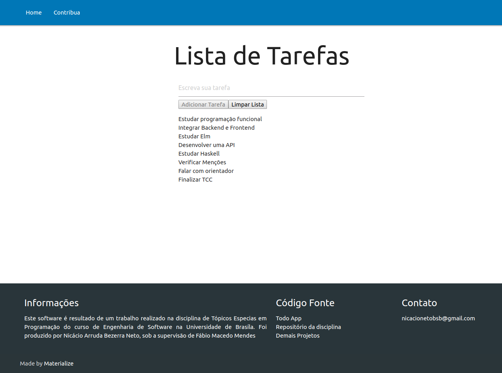

# Elm Todo app

## Try it
https://fga-funcional.github.io/Todo/

## Home


## TODO



## Integrantes
Nome | Matrícula | GitHub
-- | -- | --
Nicácio Arruda Bezerra Neto | 13/0015857 | [Nicacioneto](https://github.com/Nicacioneto)


## Build Instructions
### Run the following commands to compiling Elm
```cd frontend```

```elm make src/Main.elm --output ../elm.js```

Open index.html file in your browser

## Run the following commands to execute the Haskell API

```cd backend```

```stack build```

```stack exec -- tasks-api```   
